**English** | [**中文**](README.md)

<div align="center">
  

  <h1>FancyTool</h1>

  <h3>妙妙工具</h3>

  <h4>
    A lightweight desktop toolkit built with Avalonia 12 + FluentAvalonia<br>
    Targeting Windows, bundling common encryption, communication, and image utilities
  </h4>

  <div>
    
    
    
    
    
    
    <a href="#"></a>
    <a href="#"></a>
  </div>

  <br>

</div>

<br>

<div align="center">

[TODO: Product Page / User Guide](#)

</div>

<br>

## 🌟 Features

### 🛰️ Communication Debug

- 🛰️ **Serial Port Debug**: send / receive over COM ports via `System.IO.Ports`
- 🌐 **TCP Server**: TCP server-side debug tool with connection management
- 📡 **UDP Communication**: UDP send / receive debug with HEX / ASCII switching

### 🔐 Encryption & Encoding

- 🔒 **Symmetric Ciphers**: DES, AES, SM4 (national cipher)
- 🔑 **Asymmetric Ciphers**: RSA, SM2 (national cipher) key pair generation and encryption
- #️⃣ **Hashing**: MD5, SHA family, SM3 (national cipher) digests
- 🅱️ **Base64 Codec**: Base64 encode / decode for text

### 🗂️ File & Image Tools

- 📁 **Folder Compare**: compare two folders and list differences by relative path, SHA-256 hash, and music title
- 🔐 **File Encryption**: batch file-level encryption / decryption with progress tracking
- 🖼️ **Image → Base64**: convert an image into a Base64 string
- 🖼️ **Image Convert**: batch image format conversion (jpg / png / bmp / webp / tiff / dds / jxl / heic / ico, powered by SkiaSharp)

## 📊 Feature Matrix

| Category | Tool | Description | Algorithm / Implementation | Main Dependency |
| :--- | :--- | :--- | :--- | :--- |
| Comms | Serial Port Debug | COM port send/receive | `System.IO.Ports` | System.IO.Ports |
| Comms | TCP Server | TCP server debug | `TcpListener` / `Socket` | .NET BCL |
| Comms | UDP Communication | UDP send/receive | `UdpClient` | .NET BCL |
| Symmetric | DES | DES cipher | DES | BouncyCastle.Cryptography |
| Symmetric | AES | AES cipher | AES | BouncyCastle.Cryptography |
| Symmetric | SM4 | SM4 national cipher | SM4 | BouncyCastle.Cryptography |
| Asymmetric | RSA | RSA cipher | RSA | BouncyCastle.Cryptography |
| Asymmetric | SM2 | SM2 national cipher | SM2 | BouncyCastle.Cryptography |
| Hash | MD5 | MD5 digest | MD5 | BouncyCastle.Cryptography |
| Hash | SHA | SHA-1/256/384/512 | SHA family | BouncyCastle.Cryptography |
| Hash | SM3 | SM3 national digest | SM3 | BouncyCastle.Cryptography |
| Encoding | Base64 | Text encode/decode | Base64 | .NET BCL |
| File | Folder Compare | Diff two directories | SHA-256 hash / music title | .NET BCL / ATL |
| File | File Encryption | Batch file encrypt / decrypt | AES / SM4 (extensible) | BouncyCastle.Cryptography |
| Image | Image → Base64 | Image → Base64 | Stream encoding | .NET BCL |
| Image | Image Convert | Batch image format conversion (jpg / png / bmp / webp / tiff / dds / jxl / heic / ico) | SKBitmap decode + multi-format encode + multi-size ICO packing | SkiaSharp |

## 🖼️ Screenshots

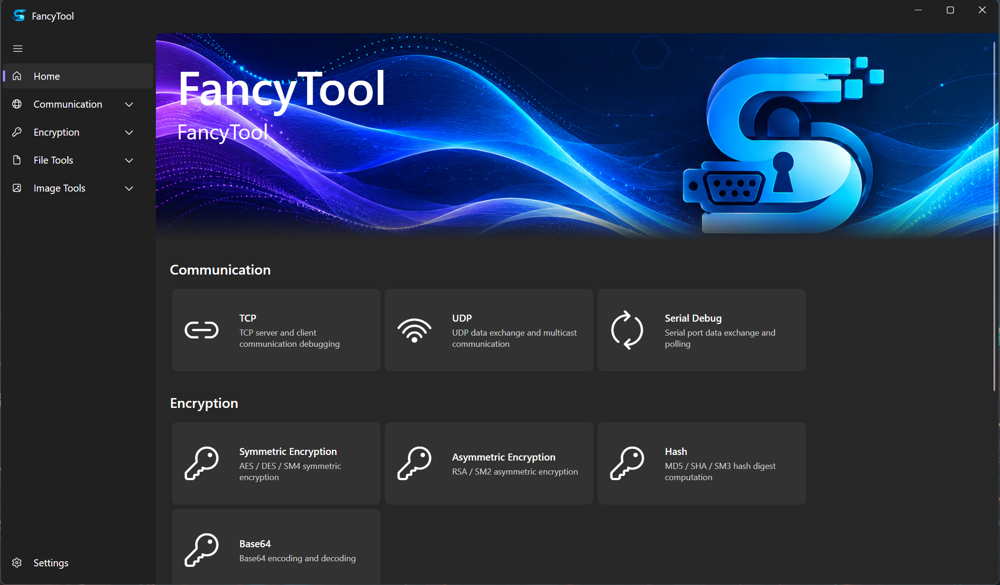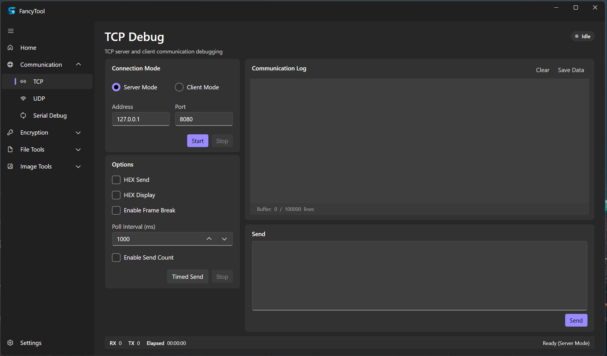
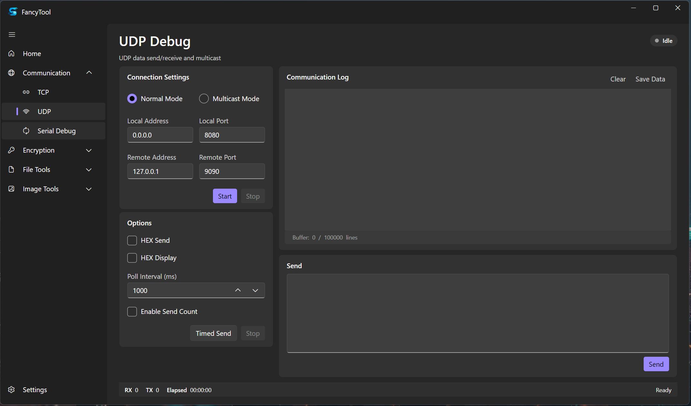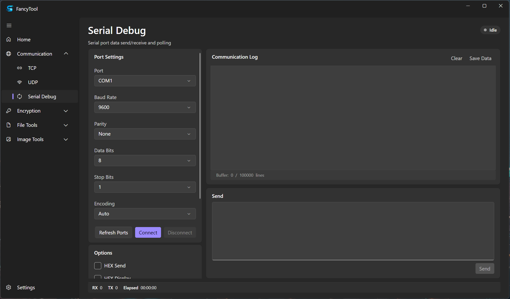
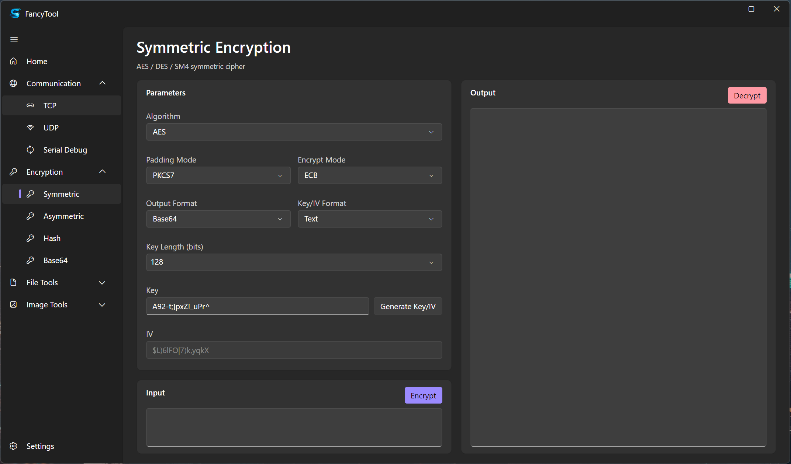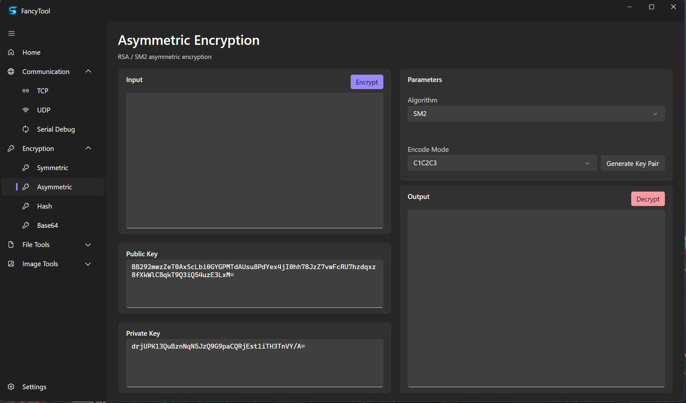
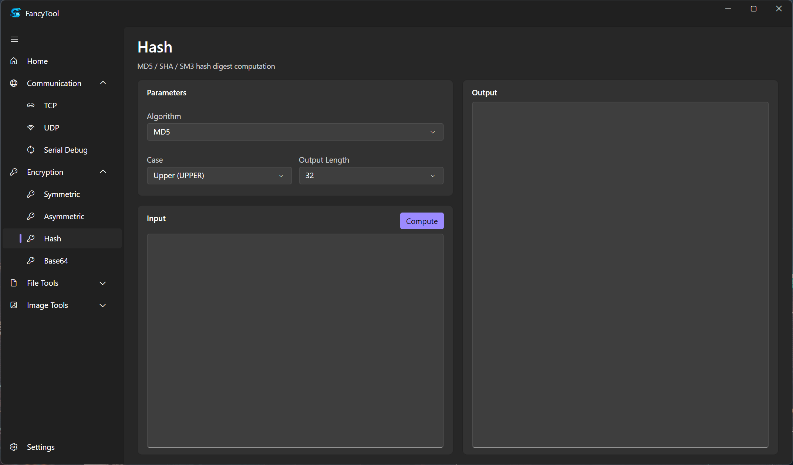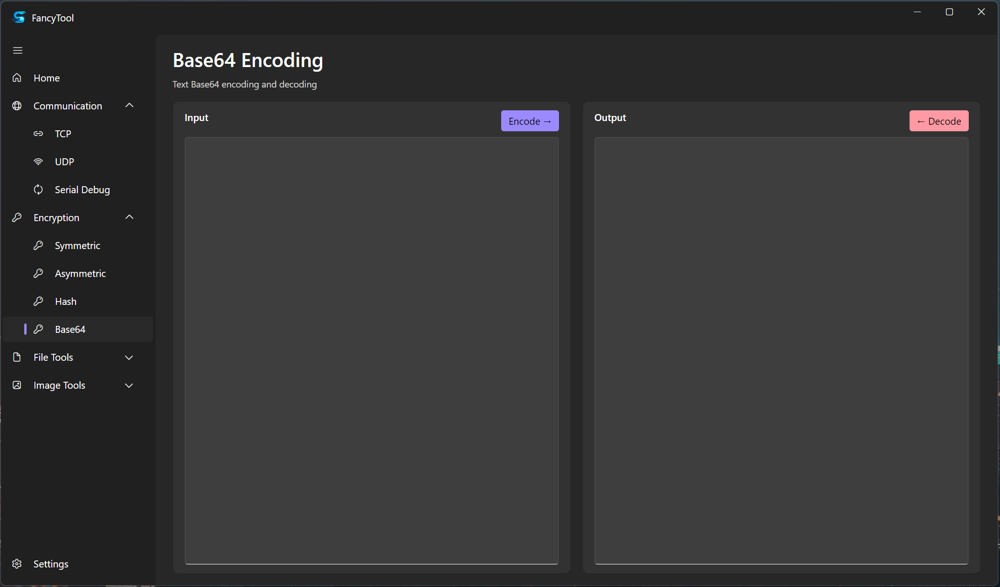
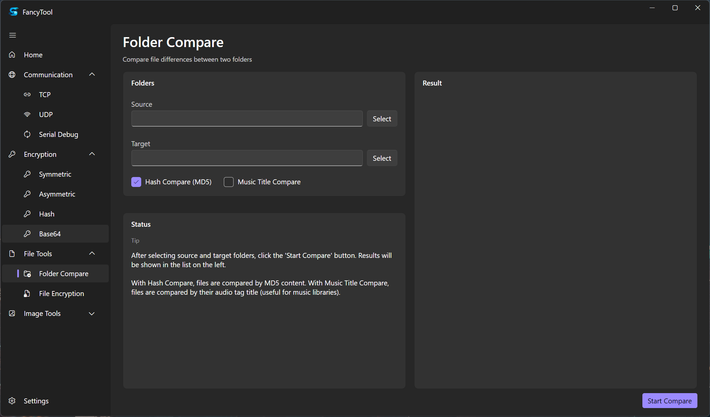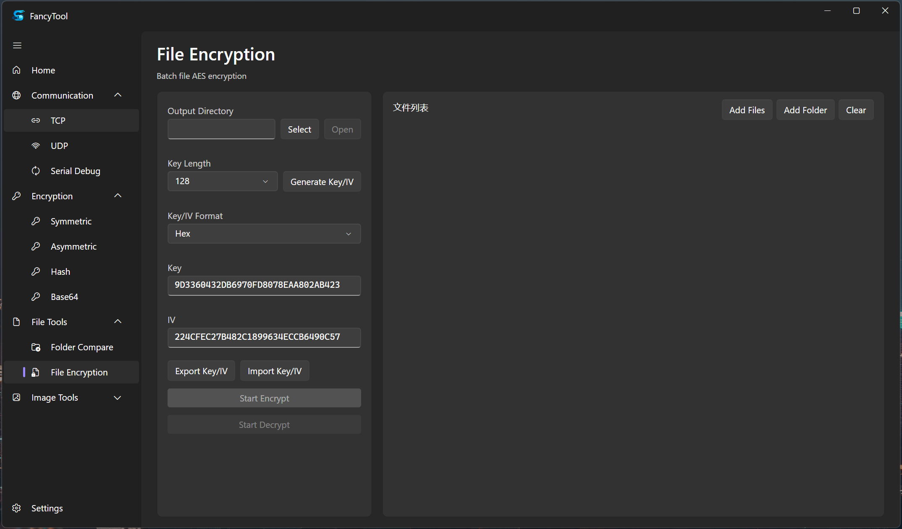
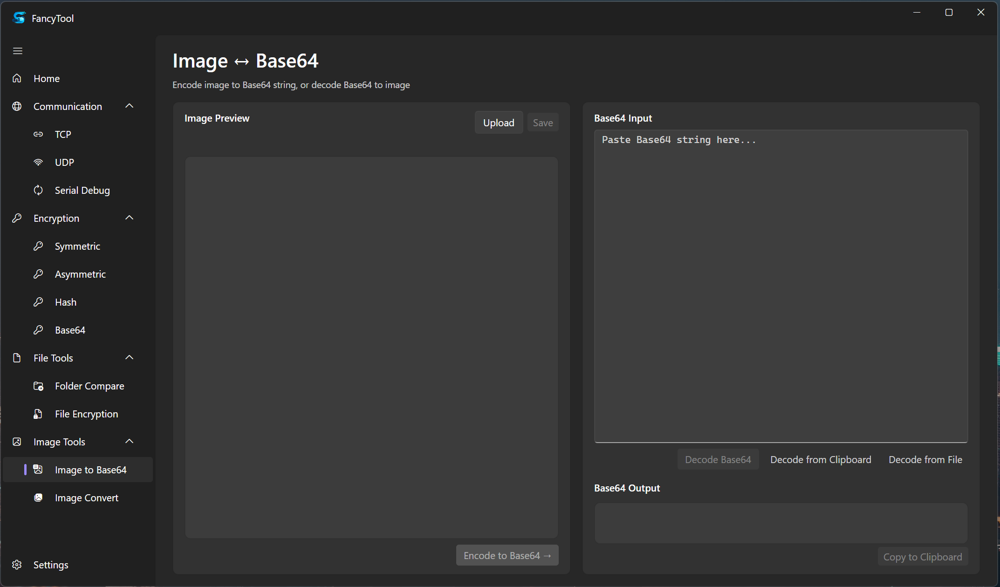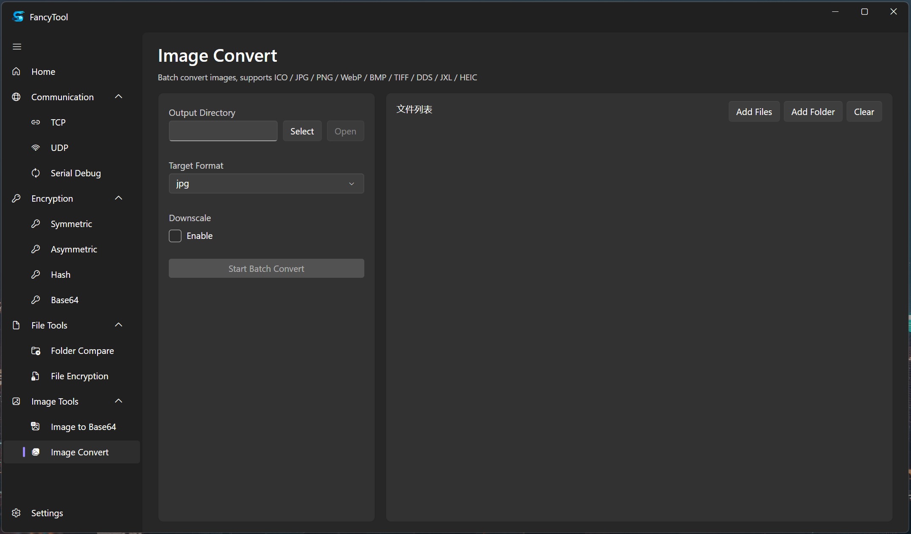


## 🧱 Architecture

- **UI**: Avalonia 12 desktop + FluentAvalonia 3.0 (FANavigationView / Frame / ContentDialog family); supports System / Light / Dark themes
- **MVVM**: `CommunityToolkit.Mvvm` with `[ObservableProperty]` / `[RelayCommand]` source generation
- **Dependency Injection**: `Microsoft.Extensions.DependencyInjection` container wires up services, ViewModels and algorithms (`AddSingleton` / `AddTransient` / `AddKeyedSingleton`) in `App.axaml.cs`
- **Navigation**: `NavigationFactory` implements `IFANavigationPageFactory`; `FAFrame.NavigateFromObject` jumps between pages; `IViewLifecycle` hooks fire on entry / exit
- **State Persistence**: `IViewStateService` serializes per-tool page state; `AppPreferences` persists theme, animations, shadows, notification placement, etc.; `ApplicationHostService` calls `LoadState` / `LoadViewStates` on launch and `SaveState` on exit
- **Logging**: `Serilog` 4 + `Serilog.Extensions.Logging` bridging `Microsoft.Extensions.Logging`; daily-rolling output to `{AppBaseDirectory}\logs\tool-.log`, capped at 50 MB per file, 30 days retained
- **Stability**: `Program.cs` registers `AppDomain.UnhandledException` and `TaskScheduler.UnobservedTaskException`; startup failures surface through `MessageBoxW`
- **Publishing**: Native AOT for non-Debug builds (`PublishAot`); `FolderProfile.pubxml` provides `SelfContained` + `PublishSingleFile` folder publishing; two PowerShell scripts at the repo root act as entry points — `publish-win.ps1` (Windows x64 self-contained publish) and `publish-linux-deb.ps1` (`.deb` packaging backed by the `Packaging.Targets` `CreateDeb` MSBuild target); both wrap `dotnet` subprocess calls

## 🛠️ Build

### Prerequisites

- [.NET 10 SDK](https://dotnet.microsoft.com/) (SDK version and `rollForward` policy are pinned in `global.json`)
- Windows 10 19041 or later
- Visual Studio 2026 recommended

### Build from Source

A PowerShell build script ships at the repo root. It defaults to `Release` / `win-x64` and enables NativeAOT:

```powershell
# Windows PowerShell 5.1+ or PowerShell 7+
pwsh -File .\publish-win.ps1
```

Optional parameters:

```powershell
# Custom configuration and output directory
pwsh -File .\publish-win.ps1 -Configuration Debug -Output .\out\debug
```

Output is placed at `bin\Release\net10.0\win-x64\publish\win-x64\`. Launch `FancyToolAva.exe` to start the app.

### Debug Run

For quick iteration outside the script, use the dotnet CLI directly:

```bash
dotnet run -c Debug
```

### Cross-Platform Distribution

- Linux x64 `.deb` package: run `pwsh -File .\publish-linux-deb.ps1` at the repo root; output lands in `dist\`
- Any-RID self-contained publish: `dotnet publish -c Release -r <RID> -p:PublishSelfContained=true` (or via `Properties\PublishProfiles\FolderProfile.pubxml`: `dotnet publish -c Release -p:PublishProfile=FolderProfile`)

## 💖 Dependencies & Credits

### Third-Party Libraries

| Library | Purpose | License |
| :--- | :--- | :--- |
| [Avalonia](https://avaloniaui.net/) | Cross-platform UI framework | MIT |
| [Avalonia.Desktop](https://avaloniaui.net/) | Desktop runtime | MIT |
| [Avalonia.Fonts.Inter](https://avaloniaui.net/) | Inter font | MIT |
| [FluentAvaloniaUI](https://github.com/amwx/FluentAvalonia) | Fluent Design control library | MIT |
| [CommunityToolkit.Mvvm](https://github.com/CommunityToolkit/dotnet) | MVVM source generator | MIT |
| [Microsoft.Extensions.DependencyInjection](https://learn.microsoft.com/dotnet/core/extensions/dependency-injection) | DI container | MIT |
| [Microsoft.Extensions.Logging](https://learn.microsoft.com/dotnet/core/extensions/logging) | Logging abstractions | MIT |
| [Serilog](https://serilog.net/) | Structured logging | Apache-2.0 |
| [Serilog.Extensions.Logging](https://github.com/serilog/serilog-extensions-logging) | Serilog ↔ MEL bridge | Apache-2.0 |
| [Serilog.Sinks.File](https://github.com/serilog/serilog-sinks-file) | File log sink | Apache-2.0 |
| [BouncyCastle.Cryptography](https://www.bouncycastle.org/csharp/) | Ciphers (AES / DES / RSA / SM2 / SM3 / SM4 / SHA / MD5) | MIT |
| [z440.atl.core](https://github.com/Zeugma440/atldotnet) | Audio metadata (music title extraction) | MIT |
| [System.IO.Ports](https://learn.microsoft.com/dotnet/api/system.io.ports) | Serial port communication | MIT |
| [Lang.Avalonia](https://github.com/avaloniaui/avalonia) | i18n runtime (`I18nManager` / `lan:I18n`) | MIT |
| [Lang.Avalonia.Json](https://github.com/avaloniaui/avalonia) | JSON i18n plugin (`i18n\*.json`) | MIT |
| [Avalonia.Skia](https://github.com/AvaloniaUI/Avalonia) | Skia renderer (transitive via Avalonia Desktop) | MIT |
| [SkiaSharp](https://github.com/mono/SkiaSharp) | Image processing & format conversion (directly drives ICO / PNG / JPEG / WebP / HEIF / GIF / BMP encoding) | MIT |
| [HarfBuzzSharp](https://github.com/harfbuzz/harfbuzz-sharp) | Text shaping (transitive via Avalonia Desktop) | MIT |
| [Packaging.Targets](https://github.com/qmfrederik/dotnet-packaging) | Linux `.deb` packaging (`CreateDeb` MSBuild target) | MIT |

## 📄 License

This project is licensed under the [MIT License](LICENSE).

## 📬 Contact

- Author: Sennpei Studio
- Email: dannypan9709@foxmail.com

## 🗂️ Data Storage

Application data is stored at:

- **Log directory**: `{AppBaseDirectory}\logs\`, daily rolling, ≤ 50 MB per file, 30 days retained
- **Per-tool page state**: serialized by `IViewStateService` on exit and restored on launch
- **App preferences** : managed by `AppPreferences`

---

<div align="center">
  <sub>Crafted with ❤ by Sennpei Studio</sub>
</div>
