[**English**](README.en.md) | **中文**

<div align="center">
  


  <h1>妙妙工具</h1>

  <h3>FancyTool</h3>

  <h4>
    基于 Avalonia 12 + FluentAvalonia 构建的轻量级桌面工具集<br>
    面向 Windows 与 Linux 平台，集成常用加密、通讯与图片处理工具
  </h4>
  <div>
    <a href="https://github.com/Johnwikix/LittleFancyToolAva/releases/latest"></a>
    
    
    
    
    
    
  </div>

  <div>
    <a href="https://github.com/Johnwikix/LittleFancyToolAva"></a>
    
    
    
  </div>


  <br>

</div>

<br>

## 📥 下载与安装

<div align="center">

| Microsoft Store（推荐） |
| :---: |
| <a href="https://apps.microsoft.com/detail/9P543GHQQKVK?referrer=appbadge&mode=direct"></a><br>通过 Microsoft Store 获取最佳安装与更新体验 |

</div>

<br>

## 🌟 核心功能

### 🛰️ 通信调试

- 🛰️ **串口调试**：基于 `System.IO.Ports` 的串口收发与调试
- 🌐 **TCP 服务器**：TCP 服务端调试工具，支持连接管理
- 📡 **UDP 通信**：UDP 收发调试，支持十六进制 / ASCII 切换

### 🔐 加解密与编码

- 🔒 **对称加密**：DES、AES、SM4（国密）字符串加解密
- 🔑 **非对称加密**：RSA、SM2（国密）密钥对生成与加解密
- #️⃣ **哈希计算**：MD5、SHA 系列、SM3（国密）摘要
- 🅱️ **Base64 编解码**：文本 Base64 编码 / 解码

### 🗂️ 文件与图片工具

- 📁 **文件夹比较**：对比两个目录的内容与文件差异（按相对路径、SHA-256 哈希、音乐标题匹配）
- 🔐 **文件加解密**：批量的文件级加密 / 解密操作，支持进度跟踪
- 🖼️ **图片转 Base64**：将图片转换为 Base64 编码字符串
- 🖼️ **图片转换**：图片格式批量转换（jpg / png / bmp / webp / tiff / dds / jxl / heic / ico，基于 SkiaSharp）

## 📊 功能矩阵

| 类别 | 工具 | 说明 | 算法 / 实现 | 主要依赖 |
| :--- | :--- | :--- | :--- | :--- |
| 通信 | 串口调试 | 串口收发与调试 | `System.IO.Ports` | System.IO.Ports |
| 通信 | TCP 服务器 | TCP 服务端调试 | `TcpListener` / `Socket` | .NET BCL |
| 通信 | UDP 通信 | UDP 收发调试 | `UdpClient` | .NET BCL |
| 对称加密 | DES | DES 加解密 | DES | BouncyCastle.Cryptography |
| 对称加密 | AES | AES 加解密 | AES | BouncyCastle.Cryptography |
| 对称加密 | SM4 | SM4 国密加解密 | SM4 | BouncyCastle.Cryptography |
| 非对称加密 | RSA | RSA 加解密 | RSA | BouncyCastle.Cryptography |
| 非对称加密 | SM2 | SM2 国密加解密 | SM2 | BouncyCastle.Cryptography |
| 哈希 | MD5 | MD5 摘要 | MD5 | BouncyCastle.Cryptography |
| 哈希 | SHA | SHA-1/256/384/512 | SHA 系列 | BouncyCastle.Cryptography |
| 哈希 | SM3 | SM3 国密摘要 | SM3 | BouncyCastle.Cryptography |
| 编码 | Base64 | 文本编解码 | Base64 | .NET BCL |
| 文件 | 文件夹比较 | 两个目录差异对比 | SHA-256 哈希 / 音乐标题 | .NET BCL / ATL |
| 文件 | 文件加解密 | 文件级加密 / 解密 | AES / SM4 等（可扩展） | BouncyCastle.Cryptography |
| 图片 | 图片转 Base64 | 图片 → Base64 | 字节流编码 | .NET BCL |
| 图片 | 图片转换 | 图片格式批量转换（jpg / png / bmp / webp / tiff / dds / jxl / heic / ico） | SKBitmap 解码 + 多格式编码 + ICO 多尺寸封装 | SkiaSharp |

## 🖼️ 软件截图

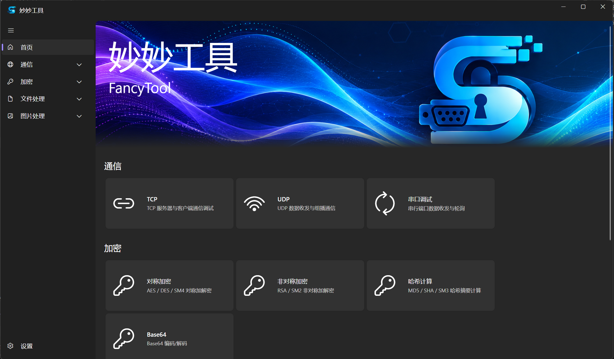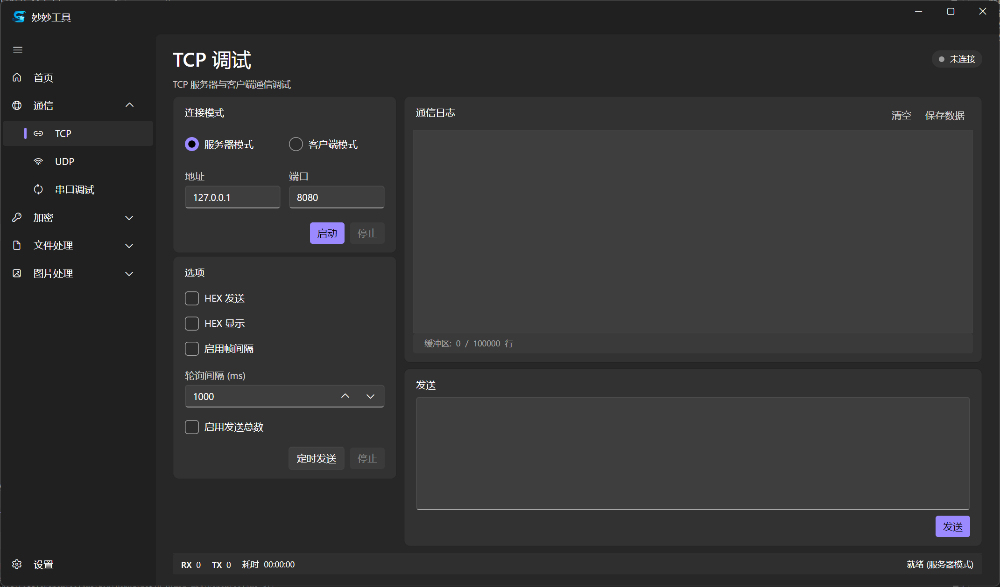
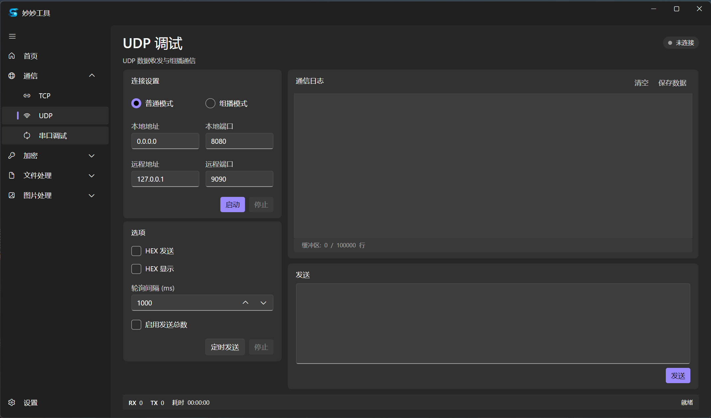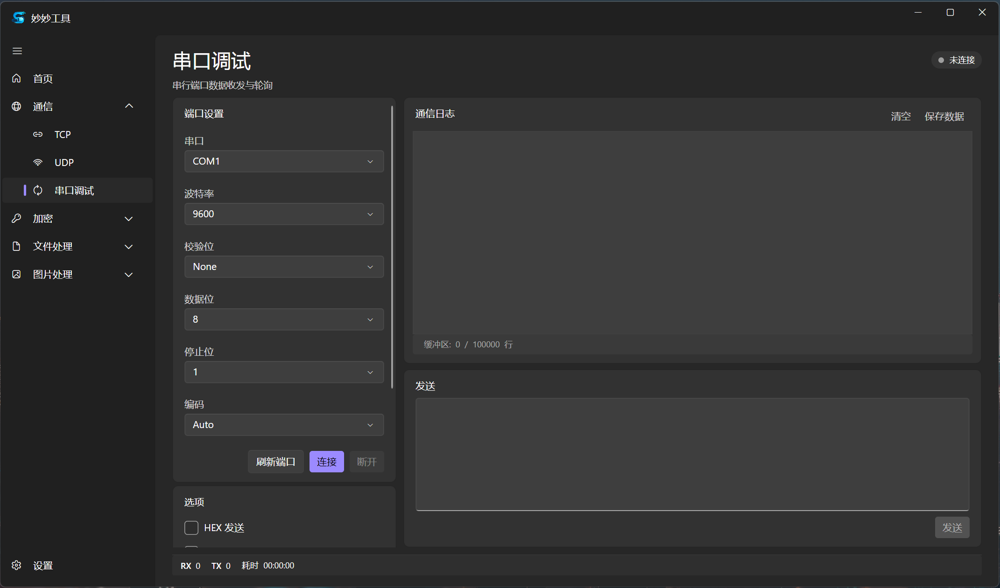
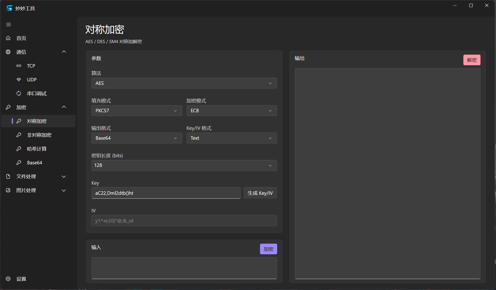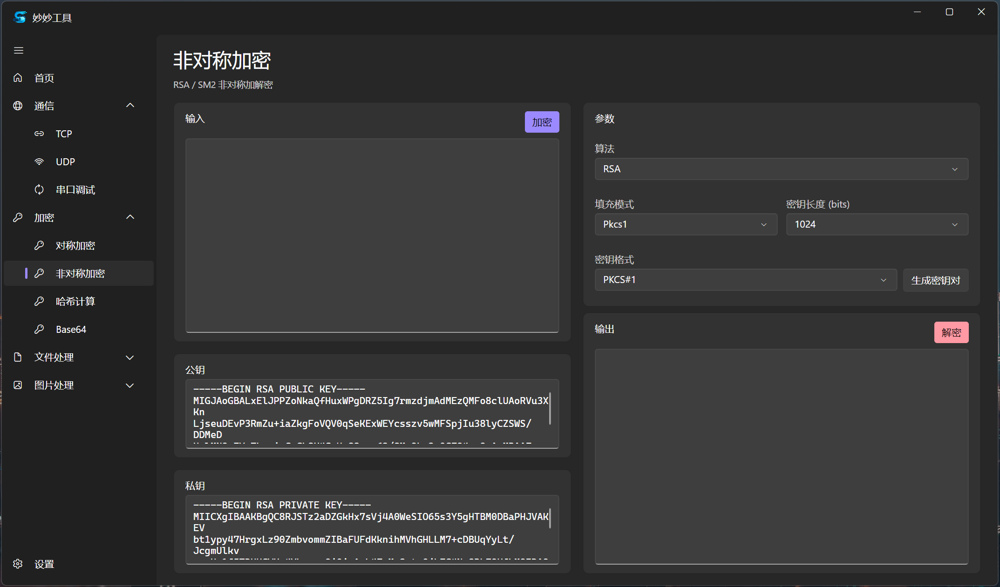
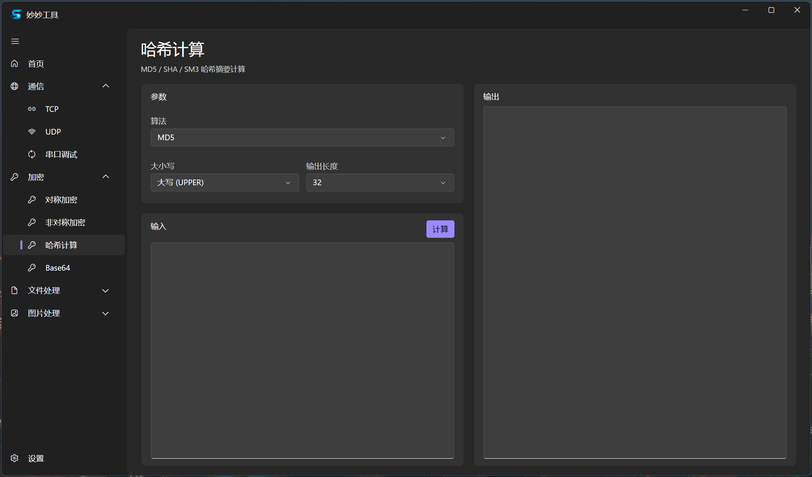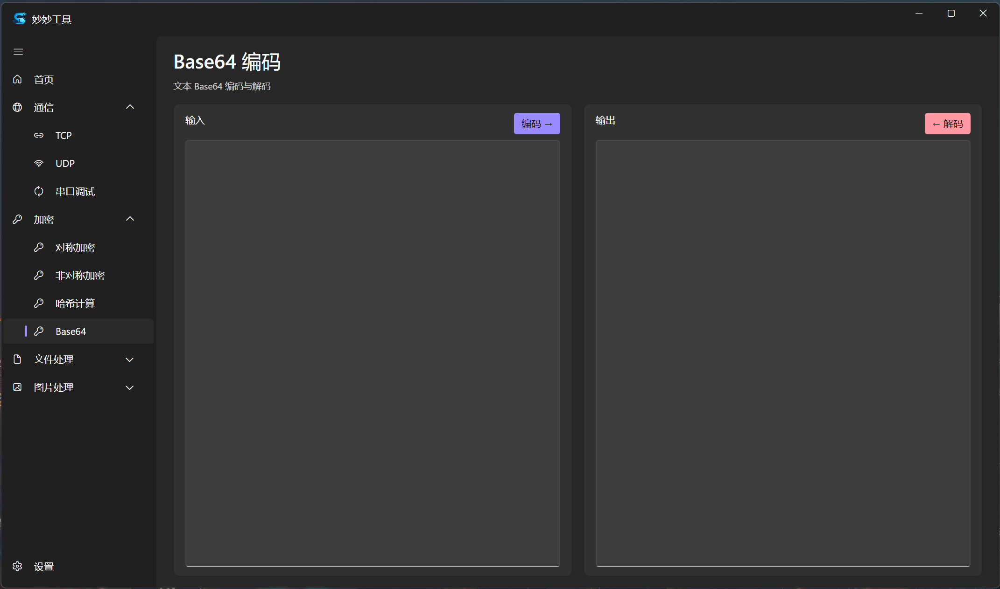
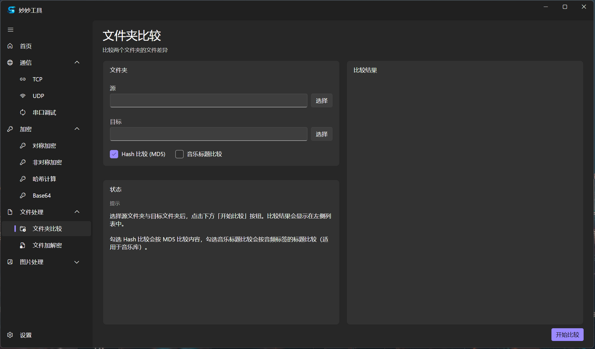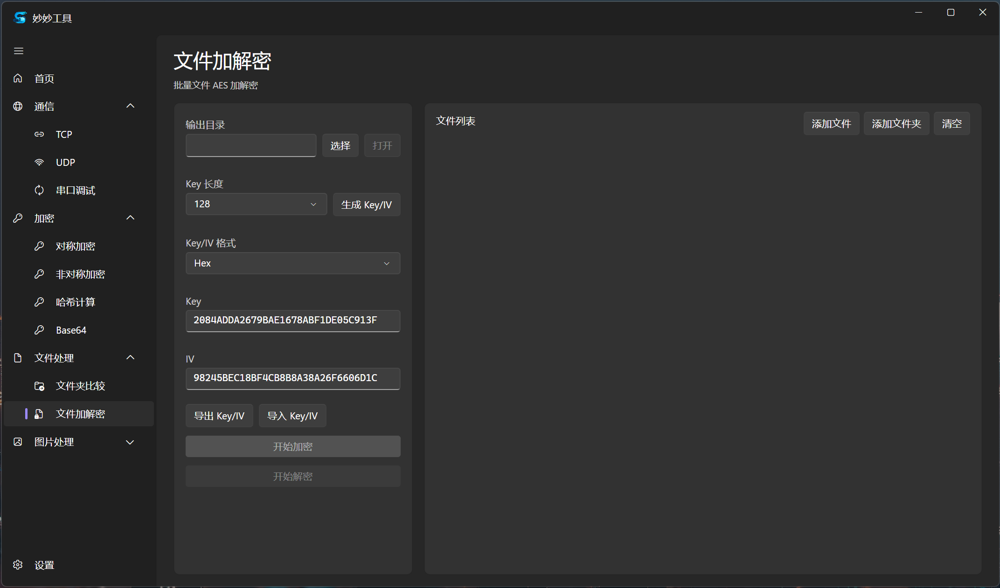
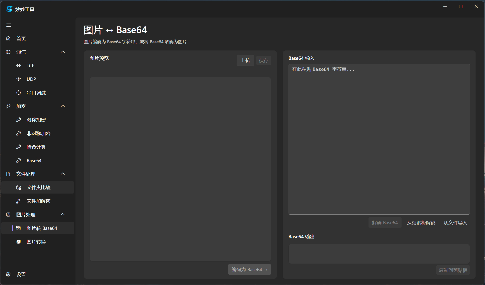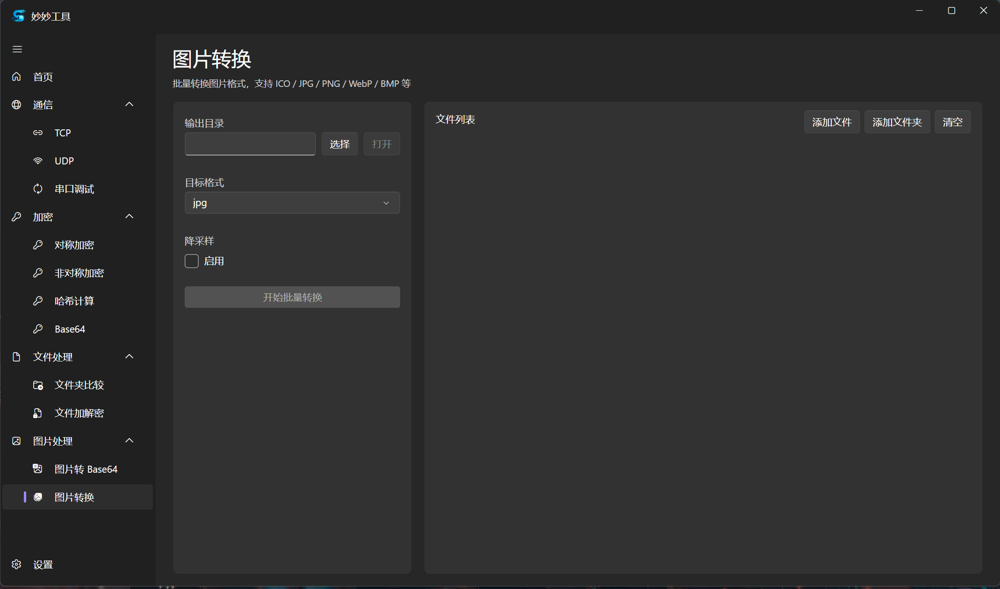

## 🧱 技术架构

- **UI**：Avalonia 12 桌面端 + FluentAvalonia 3.0（FANavigationView / Frame / ContentDialog 体系），跟随系统 / 浅色 / 深色三套主题
- **MVVM**：`CommunityToolkit.Mvvm`（`[ObservableProperty]` / `[RelayCommand]` 源生成）
- **依赖注入**：`Microsoft.Extensions.DependencyInjection` 容器统一管理 Services、ViewModels、Algorithms（`AddSingleton` / `AddTransient` / `AddKeyedSingleton`），在 `App.axaml.cs` 中配置
- **导航**：`NavigationFactory` 实现 `IFANavigationPageFactory`，通过 `FAFrame.NavigateFromObject` 跳转；`IViewLifecycle` 钩子在进入 / 离开页面时调度 ViewModel 生命周期
- **状态持久化**：`IViewStateService` 序列化各工具页面状态；`AppPreferences` 持久化主题、动画、阴影、通知位置等设置；`ApplicationHostService` 在启动时 `LoadState` / `LoadViewStates`，退出时 `SaveState`
- **日志**：`Serilog` 4 + `Serilog.Extensions.Logging` 桥接 `Microsoft.Extensions.Logging`；按天滚动写入 `{AppBaseDirectory}\logs\tool-.log`，单文件上限 50 MB，保留 30 天
- **稳定性**：`Program.cs` 注册 `AppDomain.UnhandledException` 与 `TaskScheduler.UnobservedTaskException`；启动失败时通过 `MessageBoxW` 兜底提示
- **发布**：非 Debug 启用 Native AOT（`PublishAot`）；`FolderProfile.pubxml` 提供 `SelfContained` + `PublishSingleFile` 文件夹发布；仓库根目录提供两个 PowerShell 脚本作为入口——`publish-win.ps1`（Windows x64 自包含发布）与 `publish-linux-deb.ps1`（基于 `Packaging.Targets` 的 `.deb` 打包），均封装了 `dotnet` 子进程调用

## 🛠️ 构建

### 前置条件

- [.NET 10 SDK](https://dotnet.microsoft.com/)（`global.json` 已固定 SDK 版本与 `rollForward` 策略）
- Windows 10 19041 或更高版本
- Linux x64（如 Ubuntu 22.04+，需安装 `.deb` 运行时依赖）
- 推荐使用 Visual Studio 2026

### 从源码构建

仓库根目录提供 PowerShell 构建脚本（默认 `Release` / `win-x64`，启用 NativeAOT）：

```powershell
# Windows PowerShell 5.1+ 或 PowerShell 7+
pwsh -File .\publish-win.ps1
```

可选参数：

```powershell
# 自定义配置与输出目录
pwsh -File .\publish-win.ps1 -Configuration Debug -Output .\out\debug
```

产物默认位于 `bin\Release\net10.0\win-x64\publish\win-x64\`，直接运行 `FancyToolAva.exe` 即可。

### 调试运行

脚本外如需快速迭代，可使用 dotnet CLI 直接启动：

```bash
dotnet run -c Debug
```

### 跨平台分发

- Linux x64 `.deb` 包：在仓库根目录执行 `pwsh -File .\publish-linux-deb.ps1`，产物落在 `dist\`
- Windows MSIX 包：在仓库根目录执行 `pwsh -File .\publish-msix.ps1`，脚本会先用 `FancyTool/Assets/icon.png` 重采样生成 7 张必需图标，再调用 MSBuild 生成带自签名证书的 `.msix`；产物位于 `FancyToolAva.Msix\bin\x64\Release\FancyToolAva.Msix_1.0.0.0_x64.msix`，首次安装需将 `FancyToolAva.Msix\FancyToolAva.Msix_TemporaryKey.pfx` 导入本机 `TrustedPeople` 存储
- 任意 RID 自包含发布：`dotnet publish -c Release -r <RID> -p:PublishSelfContained=true`（亦可经由 `Properties\PublishProfiles\FolderProfile.pubxml`：`dotnet publish -c Release -p:PublishProfile=FolderProfile`）

> ⚠️ **注意**：Linux 版本未充分验证，可能存在兼容性问题。

## 💖 依赖与致谢

### 第三方库

| 库 | 用途 | 许可证 |
| :--- | :--- | :--- |
| [Avalonia](https://avaloniaui.net/) | 跨平台 UI 框架 | MIT |
| [Avalonia.Desktop](https://avaloniaui.net/) | 桌面端运行支持 | MIT |
| [Avalonia.Fonts.Inter](https://avaloniaui.net/) | Inter 字体 | MIT |
| [FluentAvaloniaUI](https://github.com/amwx/FluentAvalonia) | Fluent Design 控件库 | MIT |
| [CommunityToolkit.Mvvm](https://github.com/CommunityToolkit/dotnet) | MVVM 源生成框架 | MIT |
| [Microsoft.Extensions.DependencyInjection](https://learn.microsoft.com/dotnet/core/extensions/dependency-injection) | 依赖注入容器 | MIT |
| [Microsoft.Extensions.Logging](https://learn.microsoft.com/dotnet/core/extensions/logging) | 统一日志抽象 | MIT |
| [Serilog](https://serilog.net/) | 结构化日志 | Apache-2.0 |
| [Serilog.Extensions.Logging](https://github.com/serilog/serilog-extensions-logging) | Serilog ↔ MEL 桥接 | Apache-2.0 |
| [Serilog.Sinks.File](https://github.com/serilog/serilog-sinks-file) | 文件日志输出 | Apache-2.0 |
| [BouncyCastle.Cryptography](https://www.bouncycastle.org/csharp/) | 加密算法（AES / DES / RSA / SM2 / SM3 / SM4 / SHA / MD5） | MIT |
| [z440.atl.core](https://github.com/Zeugma440/atldotnet) | 音频元数据（音乐标题提取） | MIT |
| [System.IO.Ports](https://learn.microsoft.com/dotnet/api/system.io.ports) | 串口通信 | MIT |
| [Lang.Avalonia](https://github.com/avaloniaui/avalonia) | 多语言运行时（`I18nManager` / `lan:I18n`） | MIT |
| [Lang.Avalonia.Json](https://github.com/avaloniaui/avalonia) | JSON 多语言插件（`i18n\*.json`） | MIT |
| [Avalonia.Skia](https://github.com/AvaloniaUI/Avalonia) | Skia 渲染层（Avalonia Desktop 传递依赖） | MIT |
| [SkiaSharp](https://github.com/mono/SkiaSharp) | 图片处理与格式转换（直接用于 ICO / PNG / JPEG / WebP / HEIF / GIF / BMP 编码） | MIT |
| [HarfBuzzSharp](https://github.com/harfbuzz/harfbuzz-sharp) | 文字整形（Avalonia Desktop 传递依赖） | MIT |
| [Packaging.Targets](https://github.com/qmfrederik/dotnet-packaging) | Linux `.deb` 包打包（`CreateDeb` MSBuild 目标） | MIT |

## 📄 许可证

本项目基于 [MIT 许可证](LICENSE) 授权。

## 📬 联系方式

- 作者：Sennpei Studio
- 邮箱：dannypan9709@foxmail.com
- 开源仓库：[https://github.com/Johnwikix/LittleFancyToolAva](https://github.com/Johnwikix/LittleFancyToolAva)

## 🗂️ 数据存储

应用程序数据存储位置：

- 偏好与日志目录：`%LocalAppData%\FancyTool\`（MSIX 下由系统重定向到包内的 LocalCache，Linux 等价于 `~/.local/share/fancy-tool/`）
- 日志子目录：`logs\`，按天滚动，单文件 ≤ 50 MB，保留 30 天
- 工具页面状态：通过 `IViewStateService` 在应用退出时序列化，启动时还原
- 应用偏好：由 `AppPreferences` 管理
- **超分模型**：`Models\` 子目录，首次启动时**自动从 HuggingFace 下载**（国内走 `hf-mirror.com`，失败回退官方源），下载一次后保留供离线运行；不再随安装包分发
  - 海外/高级用户可通过设置系统环境变量 `HF_ENDPOINT` 自定义镜像站
  - 旧版本若把 `preferences.json` 放在 EXE 旁，首次启动会自动迁移到 `%LocalAppData%\FancyTool\`

---

<div align="center">
  <sub>由 Sennpei Studio 用 ❤ 制作</sub>
</div>
